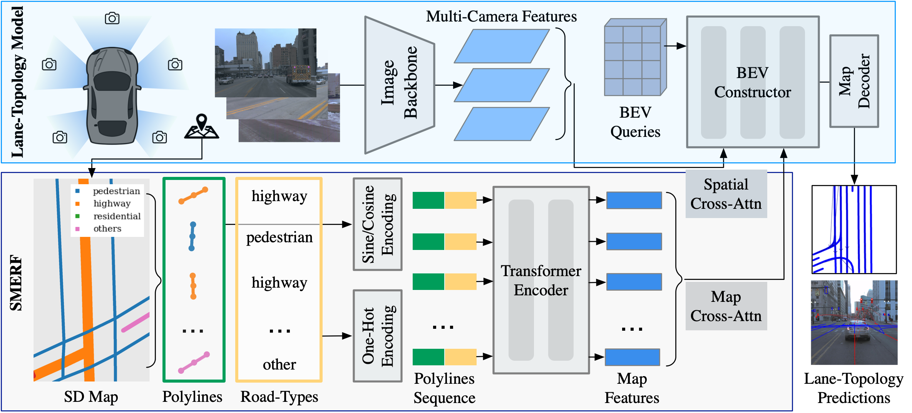

# SMERF: Augmenting Lane Perception and Topology Understanding with Standard Definition Navigation Maps


This is the official code release for

[**Augmenting Lane Perception and Topology Understanding with Standard Definition Navigation Maps**](https://arxiv.org/abs/2311.04079v1).

by [Katie Z Luo](https://www.cs.cornell.edu/~katieluo/), [Xinshuo Weng](https://www.xinshuoweng.com/), [Yan Wang](https://scholar.google.ca/citations?user=nZsD8XwAAAAJ&hl=en), [Shuang Wu](https://scholar.google.com/citations?user=LKk1jdMAAAAJ&hl=en), [Jie Li](https://scholar.google.com/citations?user=_I3COxAAAAAJ&hl=en), [Kilian Q. Weinberger](https://www.cs.cornell.edu/~kilian/), [Yue Wang](https://yuewang.xyz/), and [Marco Pavone](https://web.stanford.edu/~pavone/)

[Paper](https://arxiv.org/abs/2311.04079v1) | [Project Page](https://katieluo88.github.io/SMERF/)




## Abstract
Autonomous driving has traditionally relied heavily on costly and labor-intensive High Definition (HD) maps, hindering scalability. In contrast, Standard Definition (SD) maps are more affordable and have worldwide coverage, offering a scalable alternative. In this work, we systematically explore the effect of SD maps for real-time lane-topology understanding. We propose a novel framework to integrate SD maps into online map prediction and propose a Transformer-based encoder, SD Map Encoder Representations from transFormers, to leverage priors in SD maps for the lane-topology prediction task. This enhancement consistently and significantly boosts (by up to 60%) lane detection and topology prediction on current state-of-the-art online map prediction methods without bells and whistles and can be immediately incorporated into any Transformer-based lane-topology method.

<!-- ### TL;DR:
We provide the first  -->

## Table of Contents
- [Main Results](#main-results)
- [Installation](#installation)
- [Dataset Setup](#dataset-setup)
- [Train and Evaluate](#train-and-evaluate)
- [Citation](#citation)

## Main Results

### Results on OpenLane-V2 subset-A val

We provide results on **[Openlane-V2](https://github.com/OpenDriveLab/OpenLane-V2) subset-A val** set.

|                  | DET<sub>l</sub> | TOP<sub>ll</sub> | DET<sub>t</sub> | TOP<sub>lt</sub> |  OLS | Model | Config |
|------------------|:---------------:|:----------------:|:---------------:|:----------------:|:----:|:-----:|:------:|
|     Baseline     |       17.0      |        2.3       |       48.5      |       16.2       | 30.2 |  [ckpt](https://drive.google.com/file/d/1xC_wr7m_Uitwkdz6ioipGtlg3HY9pKA_/view?usp=sharing) |   [cfg](mmdetection3d/projects/openlanev2/configs/baseline_large_ptsrep.py)  |
| Baseline + SMERF |       **26.8**      |        **3.9**       |       **48.9**      |       **19.2**       | **34.8** |  [ckpt](https://drive.google.com/file/d/1JxtOIwLD27HeL-CZGIrt4beYXW8Pw7N3/view?usp=sharing) |   [cfg](mmdetection3d/projects/openlanev2/configs/baseline_large_ptsrep_smerf.py)  |
|      Toponet     |       28.2      |        4.1       |       44.5      |       20.6       | 34.5 |  [ckpt](https://drive.google.com/file/d/1Qy-sH5cUco_HTtG8xxyV-4FxRZezB_qS/view?usp=sharing) |   [cfg](mmdetection3d/projects/toponet_openlanev2/configs/toponet_r50_8x1_24e_olv2_subset_A.py)  |
|  Toponet + SMERF |       **33.4**      |        **7.5**       |       **48.6**      |       **23.4**       | **39.4** |  [ckpt](https://drive.google.com/file/d/1SN1CQOq8tMBXbSF4Sh3LLcrRqR4pjR22/view?usp=sharing) |   [cfg](mmdetection3d/projects/toponet_openlanev2/configs/toponet_smerf.py)  |


## Installation

### Prerequisites

- Linux
- Python 3.8.15
- NVIDIA GPU + CUDA 11.1
- PyTorch 1.9.1

### Environment Setup
We recommend using [conda](https://www.anaconda.com/download) to run the code. Alternatively, we provide a [Dockerfile](Dockerfile) for ease of installation.

```bash
conda create -n smerf python=3.8 -y
conda activate smerf

pip install torch==1.9.1+cu111 torchvision==0.10.1+cu111 -f https://download.pytorch.org/whl/torch_stable.html
```

Install mm-series packages.
```bash
pip install mmcv-full==1.5.2 -f https://download.openmmlab.com/mmcv/dist/cu111/torch1.9.0/index.html
pip install mmdet==2.26.0
pip install mmsegmentation==0.29.1
```

Install other required packages.
```bash
cd SMERF
pip install -r requirements.txt
```

This code base uses mmdetection3D, and all relevant code for the project is in the `mmdetection3d/projects` directory. Set up mmdetection3D, corresponding to `mmdet3d==1.0.0rc6`:
```bash
cd SMERF/mmdetection3d
pip install -v -e .
```

Install dependencies for OpenStreetMap:
```bash
pip install osmnx==1.5.1
pip install av2==0.2.1
pip install geocube==0.3.3
pip install sparse==0.14.0
```

If errors occur, manually upgrade the following packages:
```bash
pip install --upgrade jupyter_core jupyter_client
pip install --upgrade "protobuf<=3.20.1"
```


## Dataset Setup
Follow the [OpenLane-V2 repo](https://github.com/OpenDriveLab/OpenLane-V2/blob/v1.0.0/data) to download the data. Preprocess the data for training and evaluation:
 <!-- and run the [preprocessing](https://github.com/OpenDriveLab/OpenLane-V2/tree/v1.0.0/data#preprocess) code. -->

```bash
cd data
python OpenLane-V2/preprocess.py 
```

After setup, the hierarchy of folder `data/OpenLane-V2` should look as follows:
```
data/OpenLane-V2
├── train
|   └── ...
├── val
|   └── ...
├── test
|   └── ...
├── data_dict_subset_A_train.pkl
├── data_dict_subset_A_val.pkl
├── data_dict_subset_B_train.pkl
├── data_dict_subset_B_val.pkl
├── ...
```

### SD Map Processing
This work uses Standard Definition (SD) maps; our SD maps are pulled from [OpenStreetMap](https://www.openstreetmap.org). Download and process the SD maps relevant to this dataset:

```bash
cd openlanev2
python sd_maps/load_sdmap_graph.py --collection data_dict_subset_A_[train/val] --city_names [train/val]_city
```

A script for parallelizing the process is provided at `openlanev2/sd_maps/load_sdmap.sh`.


## Train and Evaluate 

### Train

This work reported numbers for models trained with 8 GPUs. If a different number of GPUs is utilized, you can enhance performance by configuring the `--autoscale-lr` option. 

```bash
cd SMERF/mmdetection3d
bash tools/dist_train.sh [config] 8 [--autoscale-lr]
```
The training logs will be saved to `work_dirs/[config]`.

For example, to train the OpenLane-V2 baseline model with SMERF map embeddings on 8 GPUs, run:
```bash 
bash tools/dist_train.sh projects/openlanev2/configs/baseline_large_ptsrep_smerf.py 8
```

**Edit:**
It has been brought to my attention that the baseline model might take too much memory for most machines. One thing I would suggest is to run the Toponet baseline. Their model is more lightweight and (as a plus) yields better results. Run distributed training with:
```bash
bash tools/dist_train.sh projects/toponet_openlanev2/configs/toponet_smerf.py 8
```
### Evaluation and Visualization
You can set `--eval-options visualization=True` to visualize the results.

```bash
cd SMERF/mmdetection3d
bash tools/dist_test.sh [config] [checkpoint_path] 8 --eval * [--eval-options visualization=True visualization_num=200]
```

### Training and evaluating on geographically disjoint set
To reproduce the split from the geographically disjoint OpenLane-V2 split, run the preprocessing code:
```bash
cd data
python OpenLane-V2/process_disjoint_split.py
```

The model configs and checkpoints are provided for training and evaluation:

|                  |  OLS | Model | Config |
|------------------|:----:|:-----:|:------:|
|     Baseline     | 16.9 |  [ckpt](https://drive.google.com/file/d/16b84LmalpMHYUxpS3o_XdV4wvcVIfZSl/view?usp=share_link) |   [cfg](mmdetection3d/projects/openlanev2/configs/baseline_large_ptsrep_disjoint.py)  |
| Baseline + SMERF | **22.1** |  [ckpt](https://drive.google.com/file/d/1uldQ8e9cDsUa9f0Jc7fWWXIyDSGalJus/view?usp=sharing) |   [cfg](mmdetection3d/projects/openlanev2/configs/baseline_large_ptsrep_disjoint_smerf.py)  |
|      Toponet     | 21.7 |  [ckpt]() |   [cfg](mmdetection3d/projects/toponet_openlanev2/configs/toponet_disjoint.py)  |
|  Toponet + SMERF | **23.4** |  [ckpt]() |   [cfg](mmdetection3d/projects/toponet_openlanev2/configs/toponet_disjoint_smerf.py)  |

## Citation
If this work is helpful for your research, please consider citing us!

```
@article{luo2023augmenting,
  title={Augmenting Lane Perception and Topology Understanding with Standard Definition Navigation Maps},
  author={Luo, Katie Z and Weng, Xinshuo and Wang, Yan and Wu, Shuang and Li, Jie and Weinberger, Kilian Q and Wang, Yue and Pavone, Marco},
  journal={arXiv preprint arXiv:2311.04079},
  year={2023}
}
```
